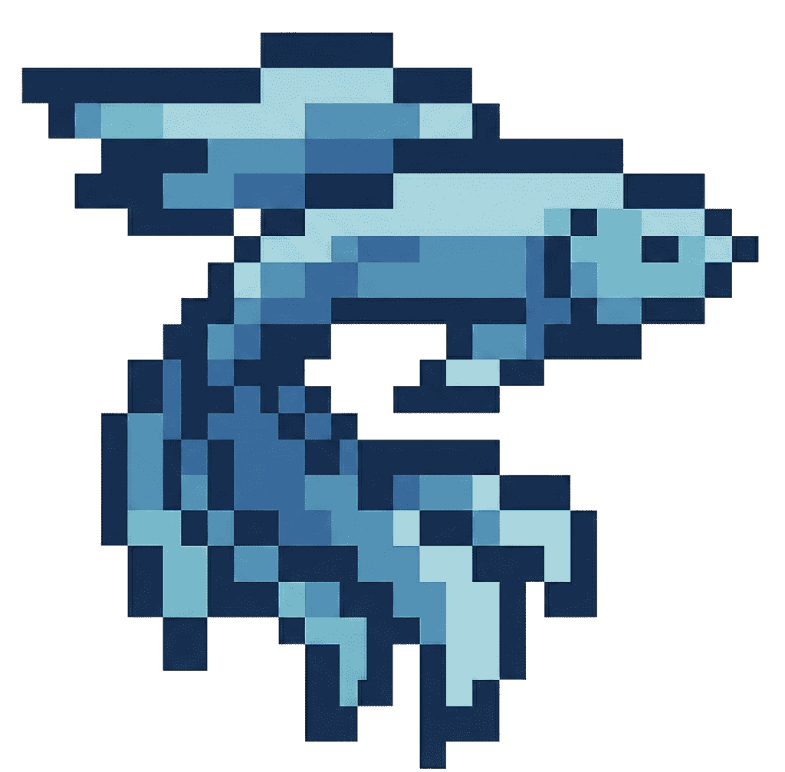

# Quark

<div align="center">



**Swarm Intelligence Engine for Social Simulation**

*Predict behavior, test scenarios, and explore outcomes with AI-powered agent simulations*

[](./LICENSE)
[](http://discord.gg/ePf5aPaHnA)
[](https://x.com/quark_ai)

</div>

---

## ⚡ Overview

**Quark** is a next-generation AI simulation engine powered by multi-agent technology. Upload real-world data — news articles, financial reports, social media trends — and watch as thousands of AI agents with distinct personalities, memories, and behaviors interact in a realistic digital sandbox.

**Use cases:**

- **Political Campaigns**: Test messaging strategies before going public
- **Brand Launches**: Simulate market reactions to product announcements  
- **Crisis Management**: Model how narratives evolve under different scenarios
- **Social Research**: Understand how opinions spread through communities
- **Entertainment**: Explore "what if" scenarios from stories and scenarios

> **Upload seed materials** (reports, articles, or scenario descriptions) and describe your simulation goals in natural language.  
> **Quark returns**: A detailed analysis report + an interactive digital world you can explore

---

## 🎯 Live Demo

Experience a live simulation of trending public opinion events: [quark-live-demo](https://quark-demo.example.com/)

---

## 📸 Screenshots

<div align="center">
<table>
<tr>
<td></td>
<td></td>
</tr>
<tr>
<td></td>
<td></td>
</tr>
</table>
</div>

---

## 🔄 How It Works

```
┌─────────────────────────────────────────────────────────────┐
│  1. BUILD GRAPH                                            │
│     Extract entities, relationships, and context from      │
│     your documents using AI-powered analysis                │
├─────────────────────────────────────────────────────────────┤
│  2. CONFIGURE ENVIRONMENT                                  │
│     Generate agent personas, set behavioral parameters,    │
│     and configure simulation rules                         │
├─────────────────────────────────────────────────────────────┤
│  3. SIMULATE                                               │
│     Run parallel simulations on multiple platforms         │
│     and watch social dynamics unfold in real-time          │
├─────────────────────────────────────────────────────────────┤
│  4. GENERATE REPORT                                        │
│     Get AI-generated insights with deep analysis of        │
│     simulation outcomes                                     │
├─────────────────────────────────────────────────────────────┤
│  5. INTERACT                                               │
│     Chat with simulated agents, interview populations,     │
│     and explore edge cases                                 │
└─────────────────────────────────────────────────────────────┘
```

---

## 🚀 Quick Start

### Prerequisites

| Tool | Version | Install |
|------|---------|---------|
| **Node.js** | 18+ | [nodejs.org](https://nodejs.org) |
| **Python** | 3.11 - 3.12 | [python.org](https://python.org) |
| **uv** | Latest | `pip install uv` |

### 1. Configure Environment Variables

```bash
# Copy the example configuration
cp .env.example .env

# Edit .env with your API keys
```

**Required variables:**

```env
# LLM API Configuration (OpenAI-compatible)
LLM_API_KEY=your_api_key
LLM_BASE_URL=https://api.openai.com/v1
LLM_MODEL_NAME=gpt-4o-mini

# Zep Cloud (vector memory)
# Free tier available at https://app.getzep.com/
ZEP_API_KEY=your_zep_api_key
```

### 2. Install Dependencies

```bash
# Install all dependencies
npm run setup:all
```

### 3. Start Services

```bash
npm run dev
```

**Services:**

- Frontend: `http://localhost:3000`
- Backend API: `http://localhost:5001`

### Docker Deployment

```bash
# Configure environment
cp .env.example .env

# Start with Docker
docker compose up -d
```

---

## 📁 Project Structure

```
Quark/
├── frontend/              # Vue.js frontend
│   ├── src/
│   │   ├── components/    # UI components
│   │   ├── views/         # Page views
│   │   ├── api/           # API clients
│   │   └── i18n/          # Translations
│   └── public/            # Static assets
├── backend/               # Python/Flask backend
│   ├── app/
│   │   ├── api/           # REST endpoints
│   │   ├── models/        # Data models
│   │   ├── services/      # Business logic
│   │   └── utils/         # Utilities
│   └── scripts/           # CLI tools
├── locales/               # i18n files
└── static/                # Shared assets
```

---

## 🛠️ Technology Stack

| Layer | Technology |
|-------|------------|
| Frontend | Vue 3, TypeScript, Vite |
| Backend | Python, FastAPI, SQLAlchemy |
| AI/ML | OpenAI API, Zep Cloud |
| Simulation | OASIS (CAMEL-AI) |
| Vector DB | Zep Cloud |

---

## 📄 License

This project is licensed under the **AGPL-3.0 License** - see the [LICENSE](./LICENSE) file for details.

---

## 🙏 Acknowledgments

Quark's simulation engine is powered by **[OASIS](https://github.com/camel-ai/oasis)** from the CAMEL-AI team. We gratefully acknowledge their open-source contributions to the multi-agent simulation community.

---

## 📈 Project Stats

<a href="https://star-history.com/#quark/quark&type=date">
 <picture>
   <source media="(prefers-color-scheme: dark)" srcset="https://api.star-history.com/svg?repos=quark/quark&type=date&theme=dark&legend=top-left" />
   <source media="(prefers-color-scheme: light)" srcset="https://api.star-history.com/svg?repos=quark/quark&type=date&legend=top-left" />
   
 </picture>
</a>
# quark
